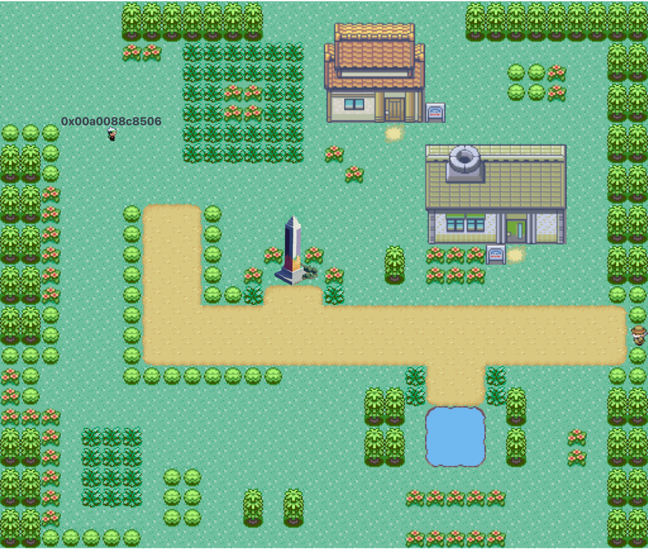

# Introduction

By the end of this tutorial you will learn how to create your own Move application, a pokémon-inspired onchain game called Constantinople, using [Obelisk](/). This will help you understand how Obelisk works and how it can be used to build any other Move application or onchain game.

We will also be exploring the [ECS model](/ecs): a software architectural pattern used commonly in video game development. Obelisk has built-in support for ECS with [recs](/client-side#recs-the-reactive-ecs-database), Obelisk’s reactive ECS database.

## Learning goals

The Constantinople tutorial is a crash course in everything Obelisk but it is a particularly good resource for learning how to build onchain games using ECS. You can expect to learn the following:

1. Onchain game development using the [ECS model](https://en.wikipedia.org/wiki/Entity_component_system).
2. How to create [schemas](/store#stores-core-data-model), interact with them using [systems](/world/world-101#systems), and call them from the client.
3. Improve onchain UX by optimistically render user actions using overridable tables.
4. Querying onchain data from the [Obelisk Schemas](/store).
5. Deplyoying all of the above to a testnet.

You can expect your finished product to look something like this:

